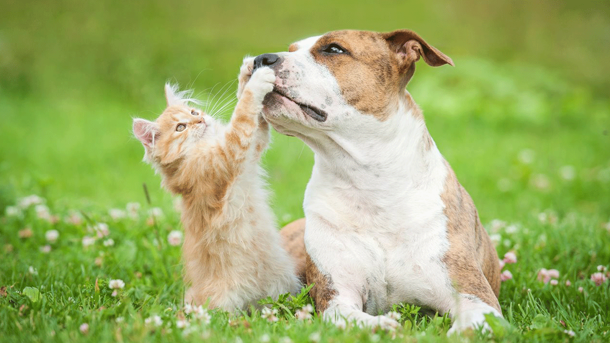

# python-ML 
My take on various Data Science Competitions/Hackathons. Performing Data **Preprocessing**, Data **Analysis**, and **creating Machine Learning models** to make **predictions on real world datasets**. Applying **Feature Engineering**, **Deep Learning**, **Ensemble Learning**.
Using [**scikit-learn**](https://scikit-learn.org) for ML, **[Keras](keras.io) with [TensorFlow](https://www.tensorflow.org) backend** for Deep Learning.

## List of Machine Learning Competitions/Hackathons:
1) [**predicting-flight-ticket-prices**](https://github.com/mohitr7/python-ML/tree/master/predicting-flight-ticket-prices): **[MachineHack](https://www.machinehack.com) [Predicting Flight Ticket Price Hackathon](https://www.machinehack.com/course/predict-the-flight-ticket-price-hackathon/)** (Got a score of 94.75 on leaderboards with a simple [Random Forest](https://github.com/mohitr7/python-ML/blob/master/predicting-flight-ticket-prices/predicting_flight_ticket_prices.ipynb) algorithm, leader score 95.5)   
    

2) [**ltfs-data-science-finhack**](https://github.com/mohitr7/python-ML/tree/master/ltfs-data-science-finhack): **[Analytics Vidya](https://www.analyticsvidhya.com) [LTFS Data Science FinHack (ML Hackathon)](https://datahack.analyticsvidhya.com/contest/ltfs-datascience-finhack-an-online-hackathon/)**. (Used an [Ensemble of ANN, LGBM and Random Forest](https://github.com/mohitr7/python-ML/blob/master/ltfs-data-science-finhack/vehicle-loan-default-prediction/vehicle_loan_default_prediction.ipynb) classifiers to get a rank in the top 6% in Vehicle Loan Default Prediction Challenge.)   
   

## Miscellaneous ML projects:
1) [**camera-calibration-with-opencv-python**](https://github.com/mohitr7/python-ML/tree/master/camera-calibration-with-opencv-python): Using [OpenCV-Python](https://opencv-python-tutroals.readthedocs.io/en/latest/py_tutorials/py_tutorials.html) to perform [camera calibration](https://github.com/mohitr7/python-ML/blob/master/camera-calibration-with-opencv-python/camera_calibration_with_computer_vision.ipynb).   

 

   

2) [**kaggle-titanic-dataset**](https://github.com/mohitr7/python-ML/tree/master/kaggle-titanic-dataset): Performing binary classification on **[Kaggle](https://www.kaggle.com/) [Titanic](https://www.kaggle.com/c/titanic)** dataset.  
    Using: 
    - [Random Forest, Logistic Regression, SVM](https://github.com/mohitr7/python-ML/blob/master/kaggle-titanic-dataset/kaggle_titanic_dataset.ipynb) algorithms.
  
    - [ANN](https://github.com/mohitr7/python-ML/blob/master/kaggle-titanic-dataset/kaggle_titanic_dataset_with_ANN.ipynb).   
   

3) [**kaggle-dogs-vs-cats-redux**](https://github.com/mohitr7/python-ML/tree/master/kaggle-dogs-vs-cats-redux): Performing binary image classification on **[Kaggle](https://www.kaggle.com/) [Dogs vs Cats Redux](https://www.kaggle.com/c/dogs-vs-cats-redux-kernels-edition)** dataset. Using [**Keras**](keras.io) to build a [CNN and using Data Augmentation](https://github.com/mohitr7/python-ML/blob/master/kaggle-dogs-vs-cats-redux/kaggle_dogs_vs_cats_redux.ipynb).   
 
